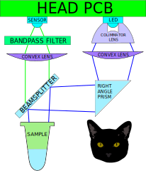
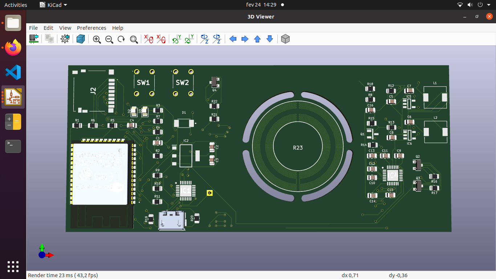
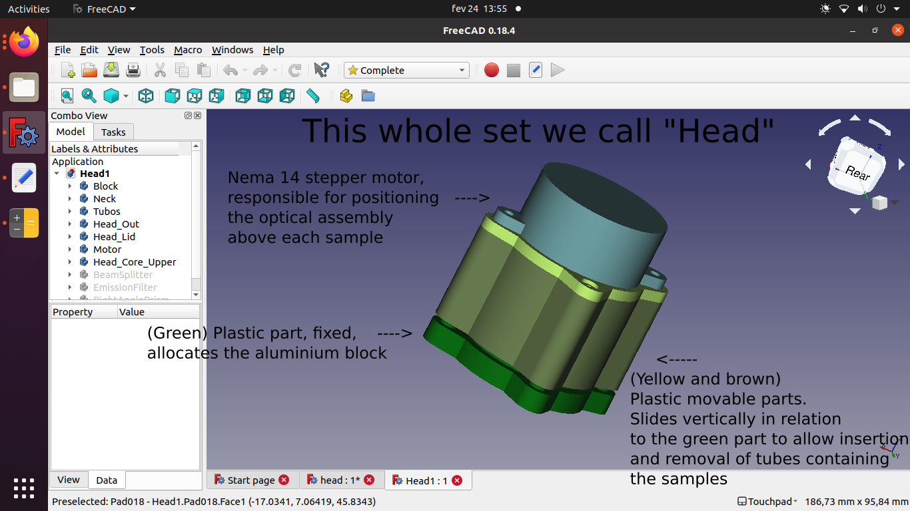
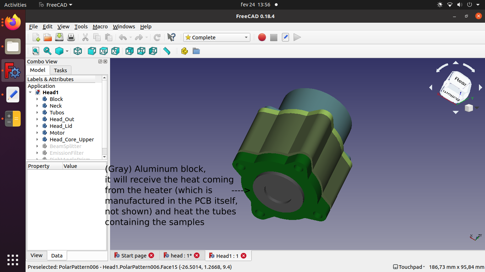

# 
An open, portable and low cost qPCR machine.

## WE ARE ACCEPTING [DONATIONS](https://www.vakinha.com.br/vaquinha/nos-ajude-a-desenvolver-uma-maquina-de-qpcr-a-baixo-custo)!: 

## Specifications*:
* 8 samples
* 2 channels (FAM/Sybr Green + HEX)
* MicroSD card slot for data logging
* Capable of High Resolution Melting Analysis for SNP detection
* WiFi interface, so you can control and visualize data from a smartphone/PC
* Portable (less than 150 mm in size)
* USB powered (5V 3A power supply)
* CHEAP

**This machine is a work in progress, so the specifications may change and/or be innacurate. Also, don't try to replicate it if you don't know what you're doing, as it probably won't work until we release a stable version.*

## How will it work?
The machine can be roughly separated into 3 parts:

* The main PCB, containing the microcontroller and the heater;
* The PCB of the reading head, containing LEDs and light sensors;
* The optical reading head, which will house lenses, beam splitters, filters, prisms, etc., as well as the stepper motor responsible for positioning this optical assembly above each tube;

